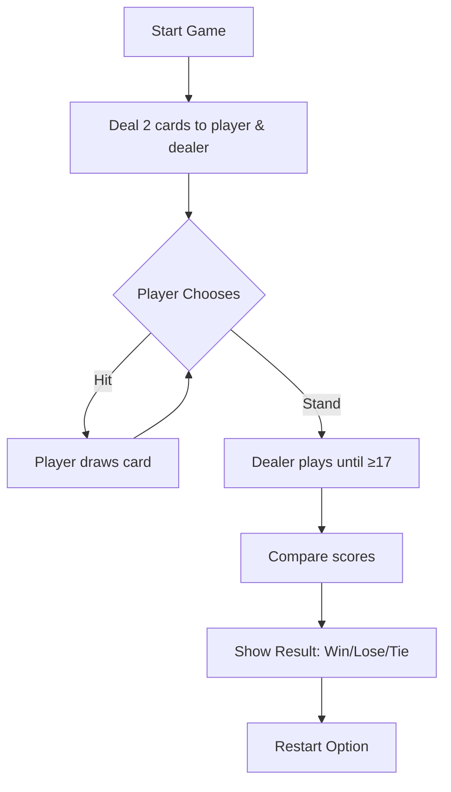
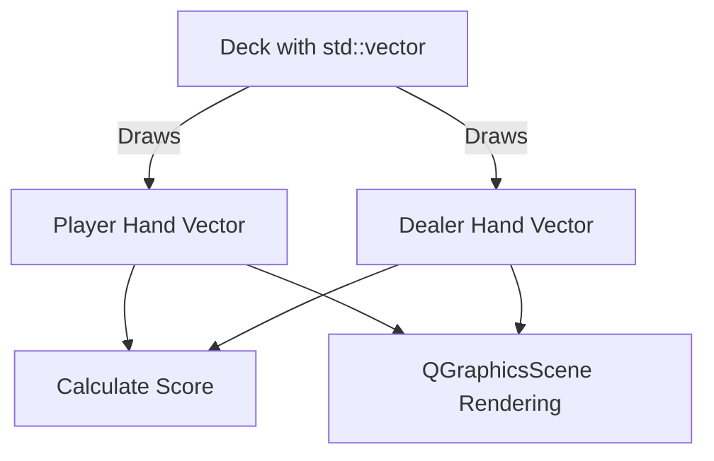

# 🃏 Blackjack_V1.02 — Qt C++ Game

This is a Qt-based Blackjack game built in C++. It uses object-oriented principles and graphical components from Qt (e.g., QGraphicsView, QGraphicsScene, QPushButton) to create an interactive card game GUI.

# 🎯 Quick Game Rules (Read First!)

**Objective:** Beat the dealer by getting your card total as close to 21 as possible — without going over.

### 🕹️ How to Play
1. **Start Game** → You and dealer get 2 cards.
2. **Your Turn:**
   - 🔘 **Hit** to draw another card.
   - 🔘 **Stand** to end your turn.
3. **Dealer’s Turn:**
   - Dealer draws until score ≥ 17.
4. **Result:** Closest to 21 wins.
   - Over 21 = **Bust** ❌ 
   - Equal scores = **Tie** 🤝

### 💰 Double Down - When and Why?
- **Best Used:** When your first two cards total 9, 10, or 11
- **Why?** Great chance to get 21 while doubling your potential win!
- **Risk:** You commit to taking only one more card

### 🧠 Examples
**Example 1: Regular Play**
| Hand         | Cards            | Score |
|--------------|------------------|-------|
| Player       | A♠, 9♦           | 20    |
| Dealer       | K♣, 7♣, 5♠       | 22    (Bust) |
| ➤ **Player Wins** |

**Example 2: Double Down Success**
| Action       | Cards            | Score | Bet  |
|--------------|------------------|-------|------|
| Initial      | 5♣, 6♥           | 11    | $10  |
| Double Down  | + 8♦             | 19    | $20  |
| Dealer       | J♠, 7♠           | 17    |      |
| ➤ **Player Wins $40!** |

**Example 3: Double Down Risk**
| Action       | Cards            | Score | Bet  |
|--------------|------------------|-------|------|
| Initial      | Q♦, 2♠           | 12    | $10  |
| Double Down  | + 9♣             | 21    | $20  |
| Dealer       | A♠, K♦           | 21    |      |
| ➤ **Tie - Bet Returned** |


### 🔁 Game Flowchart


---

## 📂 Project Structure & File Roles

| File         | Role |
|--------------|------|
| card.h / cpp | Defines a Card class — suit, rank, value, and GUI representation. |
| deck.h / cpp | Manages a 52-card deck: creation, shuffling, and drawing. |
| gameboard.h / cpp | Core gameplay logic and GUI layout: user interaction, scoring, and results. |
| main.cpp     | Launches the application with a GameBoard view. |

---

## ᵐ Qt Signals and Slots: Event Flow

Qt uses signals and slots to handle user interaction. When a user clicks a button, a signal is emitted. A slot is a method that's executed in response.

| UI Element      | Signal         | Slot Function     | Action Performed           |
|-----------------|----------------|-------------------|----------------------------|
| Hit Button      | `clicked()`    | `playerHit()`     | Player draws a card        |
| Stand Button    | `clicked()`    | `playerStand()`   | Dealer plays, then result  |
| Restart Button  | `clicked()`    | `restartGame()`   | Resets the board and deck  |

These are connected using:
```cpp
connect(hitButton, SIGNAL(clicked()), this, SLOT(playerHit()));
connect(standButton, SIGNAL(clicked()), this, SLOT(playerStand()));
connect(restartButton, SIGNAL(clicked()), this, SLOT(restartGame()));
```

---

## 🧹 Class Breakdown

### 🃏 Card

Represents one card.

| Member         | Purpose |
|----------------|---------|
| `QString suit` | "Hearts", "Spades", etc. |
| `QString rank` | "A", "K", "Q", ..., "2"  |
| `int value`    | 11 for Ace, 10 for King/Queen/Jack, others as-is |
| `QGraphicsTextItem* text` | Graphical display on card item |

Constructor:
```cpp
Card(QString suit, QString rank, int value);
```

Other method:
```cpp
int getValue() const;  // Returns value of card
```

### 🎴 Deck

Creates and manages a 52-card shuffled deck.

| Member                 | Purpose |
|------------------------|---------|
| `std::vector<Card*> cards` | Container holding all cards |

Key Methods:
- `Deck()` → Initializes all 52 cards.
- `void shuffle()` → Shuffles the deck randomly.
- `Card* drawCard()` → Draws one card from the deck.
- `int cardsLeft()` → Returns remaining cards.

### 🎮 GameBoard

Main game view, logic, and UI.

| Member                  | Purpose |
|-------------------------|---------|
| `QGraphicsScene* scene` | The visual canvas |
| `Deck* deck`            | Manages card dealing |
| `std::vector<Card*> playerHand` | Cards drawn by player |
| `std::vector<Card*> dealerHand` | Cards drawn by dealer |
| `QPushButton* hitButton` | Draw a new card |
| `QPushButton* standButton` | End turn and let dealer play |
| `QPushButton* restartButton` | Reset game |
| `QGraphicsTextItem* playerScoreText` | Player's total score |
| `QGraphicsTextItem* dealerScoreText` | Dealer's total score |
| `QGraphicsTextItem* resultText`      | "You Win", "You Lose", etc |

Key Functions:
| Function | Summary |
|----------|---------|
| `GameBoard()` | Sets up the entire game board UI and connects signals |
| `dealInitialCards()` | Deals 2 cards each to player and dealer |
| `playerHit()` | Player draws a card |
| `playerStand()` | Dealer auto-draws until >= 17 |
| `updateScores()` | Updates score displays on screen |
| `checkGameOver()` | Checks if someone won, lost, or busted |
| `calculateScore(vector<Card*>)` | Calculates hand value and adjusts for Aces |
| `restartGame()` | Resets the deck and UI |

---

## 🧼 Data Structures: Used vs Suggested

### ✔️ Data Structures Used in the Code

| Structure             | Purpose                                           | Why It Was Chosen         |
|-----------------------|---------------------------------------------------|----------------------------|
| `std::vector<Card*>`  | Store and manage dynamic card collections         | Resizable and random access |
| `QString`             | Hold suit/rank names                              | Required for Qt UI rendering |
| `QGraphicsScene`      | Graphics scene to place visual items              | Native to Qt framework      |
| `QGraphicsTextItem`   | Render card text and score labels                 | For graphical text display |

### 🌟 Suggested Improvements

| Alternative Structure | Recommended Usage             | Benefit |
|-----------------------|-------------------------------|---------|
| `std::deque<Card*>`   | Replace vector for Deck       | O(1) pop from front; more semantic deck draw behavior |
| `std::stack<Card*>`   | Draw cards from top of deck   | Enforces draw-only-top pattern, clearer intent |
| `std::array`           | For static full-deck setup    | Safer and faster fixed-size alternative to vector for 52 cards |
| `std::map<QString, int>` | Replace multiple ifs for card values | Cleaner value lookup for A, K, Q, J, etc. |

### 🔀 Optional Refactor Flowchart




---

## 🧠 Game Logic Summary

1. Game starts → GameBoard is created
2. 2 cards are dealt to each player
3. Player chooses to Hit (draw) or Stand
4. Dealer plays automatically (draws until ≥17)
5. Scores are calculated
6. Win/loss/tie is displayed
7. Restart available via button

---

## 🖼️ Visual Overview (Diagram)

The image below shows how the components interact:


- GameBoard uses Deck to draw Cards
- Card handles visual representation
- Buttons trigger signals → Game logic responds in slots
- All updates are drawn on QGraphicsScene

---

## ⚖️ Limitations & Proposed Solutions

| Limitation | Problem | Suggested Fix |
|------------|---------|---------------|
| Deck can be overdrawn | Drawing from an empty deck causes crashes | Add a check before drawing a card |
| Code duplication when drawing cards | Same logic repeated for player and dealer | Use reusable helper function |

### ✅ Fix 1: Prevent drawing from empty deck
**Before:**
```cpp
Card* card = deck->drawCard();
playerHand.push_back(card);
```

**After:**
```cpp
if (deck->cardsLeft() > 0) {
    Card* card = deck->drawCard();
    playerHand.push_back(card);
}
```

### ✅ Fix 2: Reusable drawCardToHand function
**Before:**
```cpp
Card* card = deck->drawCard();
dealerHand.push_back(card);
scene->addItem(card);
```

**After:**
```cpp
void GameBoard::drawCardToHand(std::vector<Card*>& hand) {
    if (deck->cardsLeft() > 0) {
        Card* card = deck->drawCard();
        hand.push_back(card);
        scene->addItem(card);
    }
}
```
Usage:
```cpp
drawCardToHand(playerHand);
drawCardToHand(dealerHand);
```

---
# 🃏 Blackjack Realistic Dealer Card Reveal Enhancement 

## 🔍 What Changed?  
**Before:**  
Dealer's 2nd card was always visible (less realistic)  

**After:**  
Dealer's 2nd card stays hidden until their turn (like real casinos)  

---
## 🎯 Feature Overview
| Aspect          | Before Implementation | After Implementation |
|-----------------|-----------------------|----------------------|
| **Realism**     | All cards visible immediately | Hidden card mimics real casino play |
| **Suspense**    | No anticipation build-up | True-to-life reveal moment |
| **Code Structure** | Simple immediate reveal | Special handling for hidden card |

## 🛠 Implementation Code
```cpp
/* GameBoard Class Additions */
class GameBoard {
    // ... existing code ...
    Card* dealerHiddenCard = nullptr;  // Track the face-down card

    void dealInitialCards() {
        // Deal first card (visible)
        dealerHand.push_back(deck->drawCard());
        
        // Deal second card (hidden)
        dealerHiddenCard = deck->drawCard();
        dealerHand.push_back(dealerHiddenCard);  // Add to hand but don't display
        
        // ... player card dealing logic ...
    }

    void dealerPlay() {
        // Dramatic reveal before dealer starts playing
        scene->addItem(dealerHiddenCard->getText());
        dealerHiddenCard->getText()->setPos(150, 100);
        
        // ... rest of dealer turn logic ...
    }
};
```
# 🃏 Blackjack Score Tracker Enhancement

## 📊 Feature: Win/Loss Statistics
**Adds persistent score tracking to your Blackjack game**

## ✨ Key Benefits

| Feature          | Impact                                  |
|------------------|-----------------------------------------|
| **Player Progress** | See your improvement over time        |
| **Replay Value**   | Encourages "one more game" mentality  |
| **Visual Feedback** | Clear win/loss stats on screen       |

🚀 Future Upgrades
Win Percentage Calculation
Session Saving
Achievement Badges
High Score Table

## 🔍 Key Display Elements

- 🏆 Clear win/loss counters in a bordered box  
- 🃏 Current game result with celebration emoji  
- ♠️♦️ Visible dealer cards after reveal  
- ┌─┐ Box-drawing characters for clean UI borders  

## 🎮 Game Display Example

### Live Game Session Preview

**In-Game View:**
```text
┌──────────────────────────────┐
│       BLACKJACK SCORES       │
├──────────────┬───────────────┤
│   WINS: 5    │   LOSSES: 3   │
└──────────────┴───────────────┘
┌──────────────────────────────┐
│                              │
│   You got Blackjack!         |
│   Dealer shows: ♠K ♦9        │
│                              │
└──────────────────────────────┘
```

## 🛠 Implementation Code
```cpp
// In GameBoard.h
private:
    int wins = 0;
    int losses = 0;
    QGraphicsTextItem* scoreDisplay;

// In GameBoard constructor
scoreDisplay = new QGraphicsTextItem();
scoreDisplay->setDefaultTextColor(Qt::white);
scene->addItem(scoreDisplay);
updateScoreDisplay();

// New functions
void GameBoard::gameOver(bool playerWon) {
    playerWon ? wins++ : losses++;
    updateScoreDisplay();
    statusText->setPlainText(playerWon ? "You win! 🎉" : "Dealer wins 😢");
}

void GameBoard::updateScoreDisplay() {
    scoreDisplay->setPlainText(
        "Wins: " + QString::number(wins) + 
        "  |  Losses: " + QString::number(losses)
    );
    scoreDisplay->setPos(300, 20);
}
```
## 🎥 Gameplay Demo
🎥 [Watch on YouTube](https://youtu.be/28bWt65PhqY?si=P5DqPYoQTmqNvJPK)


Using CMake:
```bash
mkdir build
cd build
cmake ..
make
./blackjack
```

---


